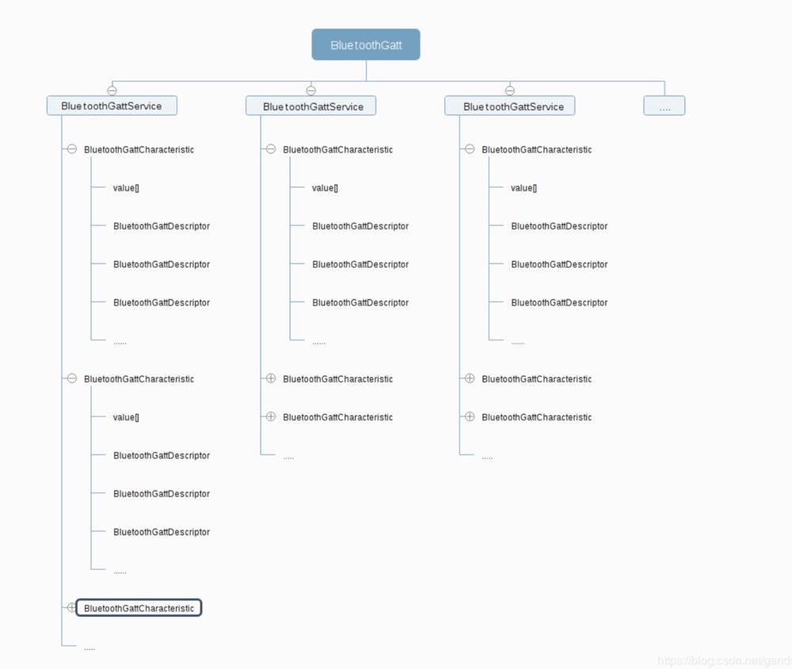

什么是蓝牙Mesh，简单的来说，就是各个客户端通过蓝牙连接成一个有一定范围性的网络，在此网络中，我们不需要连接到互联网，即使是在偏僻的地方，只要连接上这个网络，就可以跟这个网络内的其他成员进行一对一或者是群聊天。

<!-- more -->


#### 知识普及
1. 蓝牙，近距离通讯，典型距离是 10 米以内。
2. Android 4.3 开始，开始支持BLE功能，但只支持Central Mode（中心模式），即系只支持手机端扫描蓝牙设备，比如手环等。
3. Android 5.0开始，开始支持Peripheral Mode（外设模式），此时手机与手机可以相互连接。
4. Central Mode： Android端作为中心设备，连接其他外围设备，就是手机扫描其他设备。
5. Peripheral Mode：Android端作为外围设备，被其他中心设备连接。
6. BLE：Bluetooth Low Energy，蓝牙低功耗引擎

#### 用到相关的API
1. BluetoothAdapter：蓝牙适配器，低版本用于扫描和获取蓝牙mac地址，开关蓝牙等。高版本只用来判断是否支持Ble功能和开关蓝牙。
2. BluetoothGatt：蓝牙连接和通讯的核心类。包含一个或多个服务 BluetoothGattService，每个 BluetoothGattService 服务都有唯一标识的 UUID，可以通过该 UUID 获取服务，也可以获取 BluetoothGatt 中所有的服务列表。
同时每个 BluetoothGattService 也包含了一个或多个特征 BluetoothGattCharacteristic，每个特征也是通过 UUID 唯一标识，它有一个 value 字段，是一个 byte 数组。
另外每个 BluetoothGattCharacteristic 还有一个属性，一般有写类型的（PROPERTY_WRITE），订阅类型的（PROPERTY_NOTIFY），写类型是中心设备发送数据给外设用到的，订阅类型是中心设备接收外设发送的数据用到的。
每个 BluetoothGattCharacteristic 也会包含一个或多个描述 BluetoothGattDescriptor 。每个描述也是通过 UUID 唯一标识，同样也有一个 value 字段的 byte 数组。
整体结构如上，无图言diao：


#### 总体步骤
1. 检查使用相关权限；（蓝牙权限，6.0以上需要定位权限）
2. 开启Advertiser服务，增加以UUID为主的目标服务。
3. 扫描设备，判断是否是我们感兴趣的设备。（扫描前可以设置过滤器，把目标设备筛选出来）
4. 检测到有意向设备，与之建立 GATT 连接。（调用scanResult.getDevice().connectGatt方法）
5. 连接成功后，去发现对方设备的服务。
6. 发现服务成功，才算是真正连接成功。（意义上的连接成功，是指两设备连接上了，但是数据还没传输过，你也还没校验对方是不是目标设备）
7. 发现服务后，遍历对方设备的服务列表，通过我们自己的服务UUID判断是否有我们感兴趣的服务，没有的话就断开连接。
8. 获取目标服务后，读写该服务的特征值，开启订阅，接受对方设备发送过来的数据；
9. 订阅后，获取该服务的特征值，通过该特征发送数据给对方的设备端。
10. 接收到服务特征值的变化，获取该服务的values，就是对方发送过来的内容。

#### 上代码
1. Android 中使用蓝牙必须先在 AndroidManifest 中声明权限，6.0需要动态申请定位权限：
```
<uses-permission android:name="android.permission.BLUETOOTH" />
<uses-permission android:name="android.permission.BLUETOOTH_ADMIN" />
<uses-permission android:name="android.permission.ACCESS_COARSE_LOCATION" />
// 另外，如果你期望只有支持 BLE 的设备才能安装你的应用，也可以在清单文件中申明：
<uses-feature
    android:name="android.hardware.bluetooth_le"
    android:required="true" />
```
2. 检测蓝牙状态，没有就开启：
```
public static BluetoothManager getManager(Context context) {
    BluetoothManager manager = (BluetoothManager) context.getSystemService(Context.BLUETOOTH_SERVICE);
    return manager;
}
public static boolean isBluetoothEnabled(Context context) {
    boolean enabled = getManager(context).getAdapter().isEnabled();
    return enabled;
}
```
	就是上面的**BluetoothAdapter**的方法判断，如果没有开启则返回**false**，需要开启：
```
getManager(context).getAdapter().enable();
```
3. 开启Advertiser服务
```
private void startAdvertising() {
        if ((btAdapter != null) && (!isAdvertising)) {
            if (advertiser == null) {
                advertiser = btAdapter.getBluetoothLeAdvertiser();
            }
            if (advertiser != null) {
                advertiser.startAdvertising(createAdvSettings(), createAdvData(), mAdvCallback);
                isAdvertising = true;
            } else {
                Log.d("Unable to access Bluetooth LE Advertiser. Device not supported");
            }
        }
    }

// 创建目标服务对象，添加目标uuid，扫描的时候可以通过过滤该属性进行扫描
    private AdvertiseData createAdvData() {
        AdvertiseData.Builder builder = new AdvertiseData.Builder();
        builder.addServiceUuid(new ParcelUuid(serviceUUID));
        builder.setIncludeTxPowerLevel(false);
        // 这个可以添加额外的数组，作为一个参考项，如果uuid相同，可以以该data判断是否是目标设备
        builder.addManufacturerData(GraphMessage.MANUFACTURER_SPECIFIC_DATA_ID, GraphMessage.MANUFACTURER_SPECIFIC_DATA);
        return builder.build();
    }

    private AdvertiseSettings createAdvSettings() {
        AdvertiseSettings.Builder builder = new AdvertiseSettings.Builder();
        builder.setTxPowerLevel(AdvertiseSettings.ADVERTISE_TX_POWER_HIGH);
        builder.setConnectable(true);
        builder.setAdvertiseMode(AdvertiseSettings.ADVERTISE_MODE_BALANCED);
        return builder.build();
    }

```
4. 扫描设备
```
private void startScanning() {
    if ((btAdapter != null) && (!isScanning)) {
        if (scanner == null) {
            scanner = btAdapter.getBluetoothLeScanner();
        }
        if (scanCallback == null) setScanCallback();
        scanner.startScan(createScanFilters(), createScanSettings(), scanCallback);
    }
}
// 创建扫描的过滤器
private List<ScanFilter> createScanFilters() {
    ScanFilter.Builder builder = new ScanFilter.Builder();
    builder.setServiceUuid(new ParcelUuid(serviceUUID));
    ArrayList<ScanFilter> scanFilters = new ArrayList<>();
    scanFilters.add(builder.build());
    return scanFilters;
}
// 扫描设置,
// ScanSettings.SCAN_MODE_LOW_LATENCY 低延迟，扫描间隔很短，不停的扫描，更容易扫描到设备，但是更耗电一些，建议APP在前台是才使用这种模式
// ScanSettings.SCAN_MODE_LOW_POWER 省电的模式，扫描间隔会长一点，扫描到设备花的时间会长一些
// ScanSettings.SCAN_MODE_BALANCED 在扫描和耗电之间取平衡点
private ScanSettings createScanSettings() {
    ScanSettings.Builder builder = new ScanSettings.Builder();
    builder.setScanMode(ScanSettings.SCAN_MODE_BALANCED);
    return builder.build();
}
```
5. 扫描成功，连接设备：
```
private void setScanCallback(ScanCallback callback) {
        if (callback != null) {
            scanCallback = callback;
            return;
        }
        scanCallback = new ScanCallback() {
            @Override
            public void onScanResult(int callbackType, ScanResult scanResult) {
                if (Build.VERSION.SDK_INT >= Build.VERSION_CODES.M) {
                    scanResult.getDevice().connectGatt(context, false, getGattCallback(), BluetoothDevice.TRANSPORT_LE);
                } else {
                    scanResult.getDevice().connectGatt(context, false, getGattCallback());
                }
            }

            @Override
            public void onScanFailed(int i) {

            }
        };
    }
```
6. 连接成功后，发现对方设备的服务，遍历所有的服务，找到目标服务：
```
private BluetoothGattCallback getGattCallback() {
    return new BluetoothGattCallback() {
        @Override
        public void onConnectionStateChange(BluetoothGatt gatt, int status, int newState) {
            synchronized (connectedDevices) {
               ...
                switch (newState) {
                    case BluetoothProfile.STATE_DISCONNECTING:
                        break;
                    case BluetoothProfile.STATE_DISCONNECTED:
                        gatt.close();
                        break;
                    case BluetoothProfile.STATE_CONNECTED:
                        // 发现服务
                        boolean discovering = gatt.discoverServices();
                        break;
                    default:
                }
                super.onConnectionStateChange(gatt, status, newState);
            }
        }

        @Override
        public void onServicesDiscovered(BluetoothGatt gatt, int status) {
            // 服务发现成功，算是正式连上对方
            List<BluetoothGattService> serviceList = gatt.getServices();
            // 遍历所有的服务
            for (BluetoothGattService service : serviceList) {
            	// 如果uuid相等就是我们要找的服务
                if (service.getUuid().equals(serviceUUID)) {
                	// 这些不用管，储存状态的
                    HashSet<BluetoothGattCharacteristic> characteristicSet = new HashSet<>();
                    characteristicSet.addAll(service.getCharacteristics());
                    discoveredCharacteristics.put(gatt.getDevice().getAddress(), characteristicSet);
                    // 遍历目标服务，订阅通知，开启接收数据
                    for (BluetoothGattCharacteristic characteristic : characteristicSet) {
                        if (notifyUUIDs.contains(characteristic.getUuid())) {
                            setIndictaionSubscription(gatt, characteristic, true);
                        }
                    }
                }
            }
        };
// 订阅 notify 对方的服务
private void setIndictaionSubscription(BluetoothGatt peripheral,
                                       BluetoothGattCharacteristic characteristic,
                                       boolean enable) {
    // 设置服务可用，接收对方发来的信息
    boolean success = peripheral.setCharacteristicNotification(characteristic, enable);
    // 获取服务特征值的描述，往之设置数据
    BluetoothGattDescriptor desc = characteristic.getDescriptor(BLETransport.CLIENT_CHARACTERISTIC_CONFIG);
    desc.setValue(enable ? BluetoothGattDescriptor.ENABLE_INDICATION_VALUE : BluetoothGattDescriptor.DISABLE_NOTIFICATION_VALUE);
    // 真正的写数据，对方会回调onCharacteristicChanged
    boolean desSuccess = peripheral.writeDescriptor(desc);
}

// 订阅完成后，相应的会回调这些方法
@Override
public void onDescriptorWrite(BluetoothGatt gatt, BluetoothGattDescriptor descriptor, int status) {
    if (status == BluetoothGatt.GATT_SUCCESS) {
        if (Arrays.equals(descriptor.getValue(), BluetoothGattDescriptor.ENABLE_INDICATION_VALUE)) {
            // 订阅成功，获取对方的rssi
            boolean beginReadRssi = gatt.readRemoteRssi();
        } else if (Arrays.equals(descriptor.getValue(), BluetoothGattDescriptor.DISABLE_NOTIFICATION_VALUE)) {
            gatt.close();
        }
    }
}

@Override
public void onCharacteristicChanged(BluetoothGatt gatt, BluetoothGattCharacteristic characteristic) {
    super.onCharacteristicChanged(gatt, characteristic);
    // 接收到对方发过来的data(byte数组)
}

@Override
public void onCharacteristicWrite(BluetoothGatt gatt,
                                  BluetoothGattCharacteristic characteristic, int status) {
}
```
7. 向对方发送数据，所有的内容都要按照Gatt协议，转换为byte数组后进行发送：
```
public boolean write(byte[] data,UUID characteristicUuid,String deviceAddress) {
// 找到目标设备的特征值
    BluetoothGattCharacteristic discoveredCharacteristic = null;
    for (BluetoothGattCharacteristic characteristic : discoveredCharacteristics.get(deviceAddress)) {
        if (characteristic.getUuid().equals(characteristicUuid))
            discoveredCharacteristic = characteristic;
    }
    // 往特征值上去写数据
    discoveredCharacteristic.setValue(data);
    // 校验对方服务是否可写，是否已经和对方连接成功
    if ((discoveredCharacteristic.getProperties() & BluetoothGattCharacteristic.PROPERTY_WRITE) != BluetoothGattCharacteristic.PROPERTY_WRITE)
        throw new IllegalArgumentException(String.format("Requested write on Characteristic %s without Notify Property",characteristicUuid.toString()));
        // 获取gatt对象，进行写数据
    BluetoothGatt recipient = connectedDevices.get(deviceAddress);
    if (recipient != null) {
        boolean success = recipient.writeCharacteristic(discoveredCharacteristic);
        // write type should be 2 (Default)
        Timber.d("Wrote %d bytes with type %d to %s with success %b", data.length, discoveredCharacteristic.getWriteType(), deviceAddress, success);
        return success;
    }
    return false;
}

```

#### 遇到的坑
1. 项目中会用到本地蓝牙Mac地址作为key和扫描到的蓝牙的远程地址进行储存，管理每个设备的唯一性和关联性。但是在Android 6.0版本以后，Google更改了安全策略，我们无法通过代码获取到正确的mac值：
	
	Android 6.0以下的版本，可以使用BluetoothAdapter.getMacAddress来获取到正确的值：
	```
	String mac = BluetoothAdapter.getDefaultAdapter().getAddress()
	```
	Android M 以后，有的设备可以直接通过获取setting中的值：
	```
	String local = android.provider.Settings.Secure.getString(context.getContentResolver(), "bluetooth_address");
	```
	但是，这只适合于Android O (Android 8.0)以下的其中一些设备，还有一些可以通过反射的方式去获取：
	```
	if (Build.VERSION.SDK_INT >= Build.VERSION_CODES.M) {
            try {
                Field mServiceField = bluetoothAdapter.getClass().getDeclaredField("mService");
                mServiceField.setAccessible(true);
                Object btManagerService = mServiceField.get(bluetoothAdapter);
                if (btManagerService != null) {
                    bluetoothMacAddress = (String) btManagerService.getClass().getMethod("getAddress").invoke(btManagerService);
                }
            } catch (NoSuchFieldException | NoSuchMethodException | IllegalAccessException | InvocationTargetException e) {
                e.printStackTrace();
            }
        }
	```
	很忧伤💔，基本上在高版本的设备上是获取不到的！！只能放弃了这种做法，回头想想，既然只是作为本地的一个唯一标识，那么可以用其他的方式去获取或者创造一个唯一的值作为假的mac地址不就可以了？当然，要记得把唯一值转换为mac的格式。如下：
	```
	46:7F:D2:60:6F:C2
	```
2. 数据长度de问题：BLE的特征一次读写最大长度20字节，如果你的内容很长，转换为byte数组后，需要判断数组的长度，每20字节一段，然后循环BluetoothGattCharacteristic设置value进行写数据，直到写完，过程需要对新加入的消息进行排队处理，否则数据会乱。

#### 资料
1. [Android BLE蓝牙踩坑总结](https://juejin.im/post/5d37d4d6f265da1bc414958a) (很多常见的问题汇总可以参考处理)
2. [解密蓝牙mesh系列文章汇总](https://blog.csdn.net/zhanghuaishu0/article/details/78770486) （蓝牙技术联盟的一系列原理性文章）

