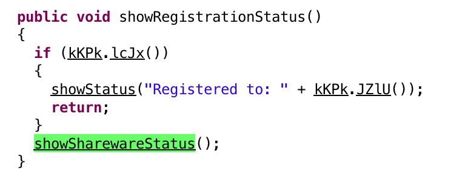

### 简介
Charles这个工具，如果大家还不知道是用来做什么的话，那你可以出门左拐了，毕竟这篇文章并不是来介绍这个工具是怎么用的。

好吧，还是简单的介绍一下吧，Charles其实是一款代理服务器抓包软件，等同于windows平台的Fiddler软件，不过Charles是用java编写的，所以能够跨平台使用。
<!-- more -->

### Charles的主要功能
- 截取Http 和 Https 网络封包
- 支持重发网络请求，方便后端调试
- 修改网络请求参数
- 支持网络请求的截获并动态修改
- 支持模拟慢速网络，主要是模仿手机上的2G/3G/4G的访问流程。
- 可以抓手机端访问的资源（如果是配置HOST的环境，手机可以借用host配置进入测试环境）

### 破解原因（仅供学习用途）
Charles 是收费软件，可以免费试用 30 天。试用期过后，未付费的用户仍然可以继续使用，但是每次使用时间不能超过 30 分钟，并且启动时将会有 10 秒种的延时。因此，该付费方案对广大用户还是相当友好的，即使你长期不付费，也能使用完整的软件功能。只是当你需要长时间进行封包调试时，会因为 Charles 强制关闭而遇到影响。


### 动手
1. 在破解之前，可以在网上看到有一大堆的文章，各种版本的破解软件，使得你下载下来的版本未必是当前最新的版本，或者你并不清楚别人家修改的破解文件会不会是不安全的文件，所以这次我们自己动手，自己修改破解。

2. 首先去官网下载最新的安装包，里面有各个平台的最新包，自行选择即可，这里我用mac平台来说明。
官网地址下载：[https://www.charlesproxy.com/download](https://www.charlesproxy.com/download)

3. 按照正常的流程安装完成后，我们可以在应用程序中，找到Charles后，右键显示包内容


4. 找到Java文件夹中的charles.jar文件，我们用jd-gui打开charles.jar之后，如图可以看到指向SplashWindow.class这个文件，双击打开。




5. 最终我们可以看到，是否注册是指向showRegistrationStatus这个方法的，当KKPK#lcJx方法为true的时候，就会显示注册信息，否则显示还没注册。

6. 我们不管KKPK#lcJx方法做了什么操作，只需要把这个方法的返回值设置为true即可，n那我们究竟怎么才能修改这个jar包里面的内容呢？方法有很多种，不管用什么方法，能达到效果即可。下面我用一种比较常规的方法去更改：
```
1. 我们看到，KKPK所在类的包名为com.xk72.charles， 所以我们新建包名路径为com.xk72.charles。

2. 复制KKPK这个类的所有内容进来，并修改

3. 编译，使得该文件变为class文件

4. 最后使用jar uvf命令覆盖回去即可。
```

7. 经过以上几个步骤即可把更改后的文件替换到jar包中


8. 最后把charles.jar文件替换原来的文件即可，打开时的页面：


### 总结
我们平时需要某个东西的时候，上网上搜索时会发现各个不一样的答案，直接拿来用倒是个不错的主意。不过因为互联网太复杂，为了一些不必要的麻烦，有时候能自己动手就自己动手，自己才是最可靠的人。

ps:另外我在学习的时候，有时候你看了几篇文章，就会觉得我学会了这种心态，但是到自己实际的操作中，可能会遇到各种各样的问题。解决问题的过程，其实学到的东西更多，所以建议不管你学什么都好，看了文章之后，不自己动手实现的东西，终究不会有太深刻的理解。

### 声明
此文章仅用作记录自己的操作，供学习使用，切勿用于非法用途，如有侵权，请告知删文，感谢。
